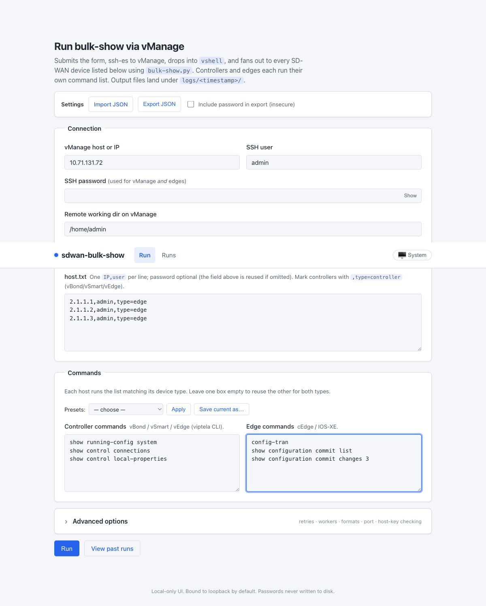
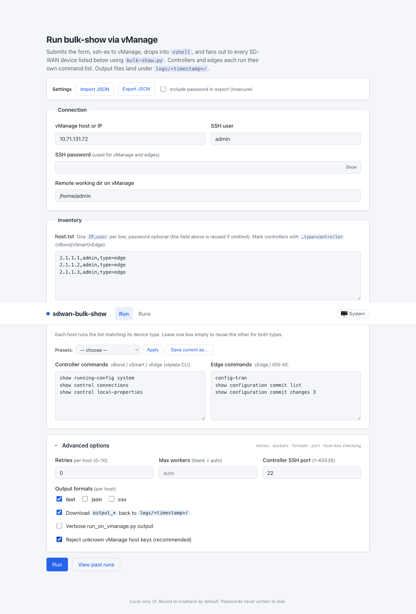
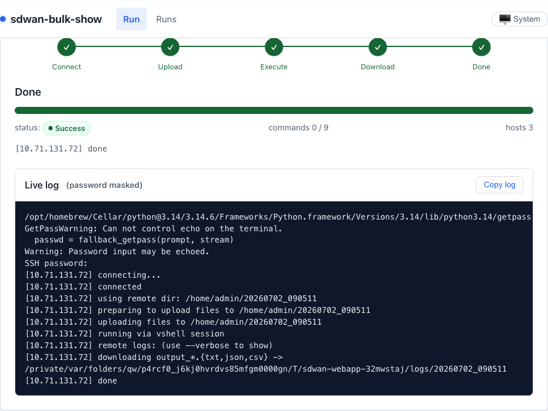
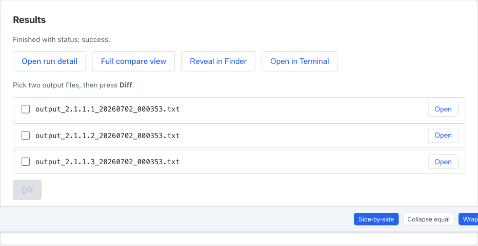
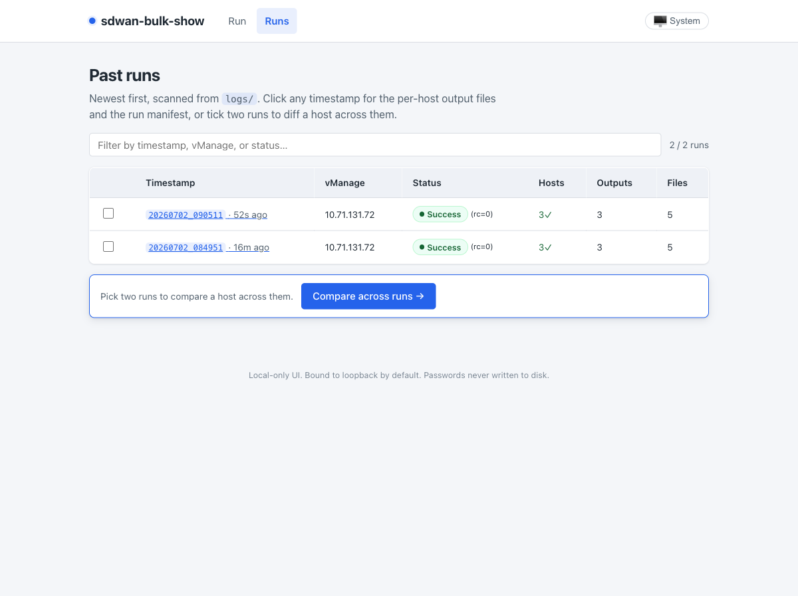
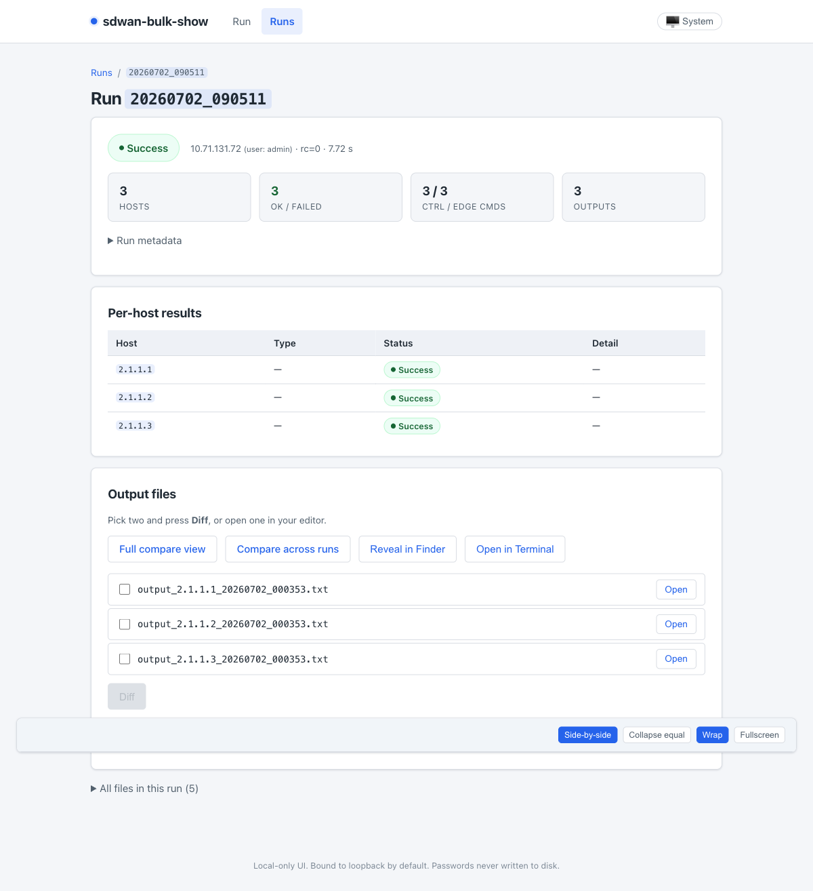
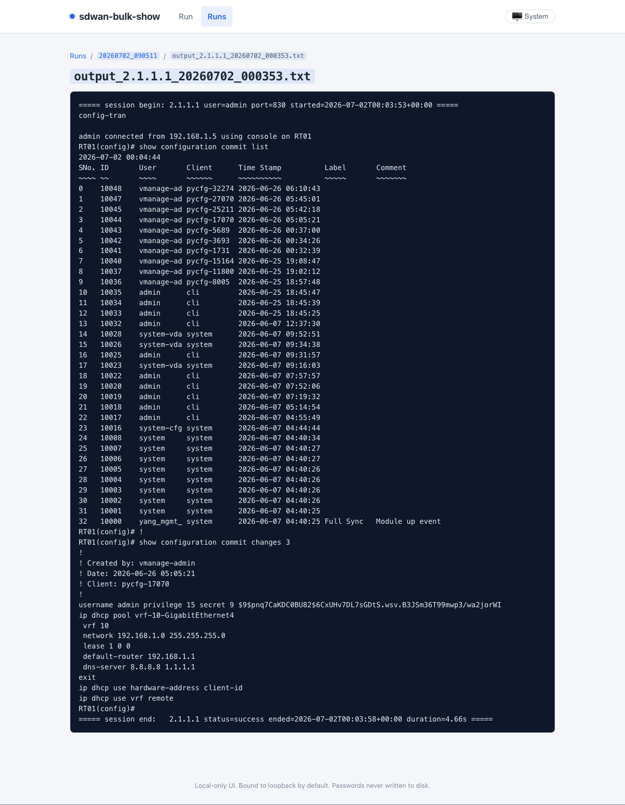
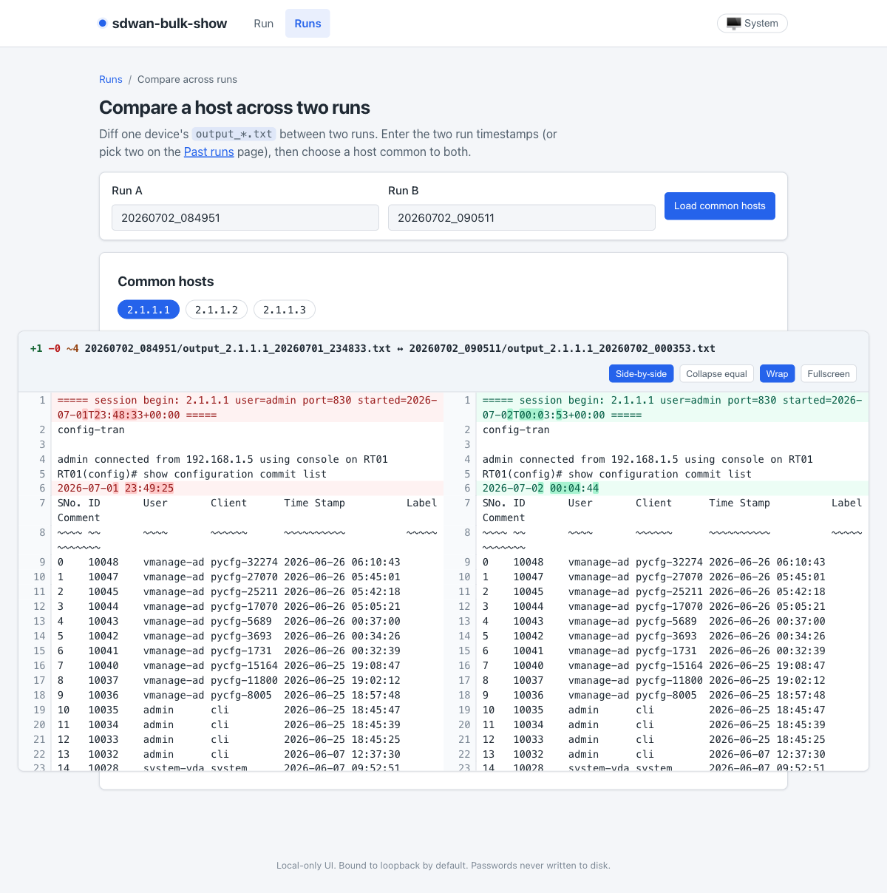
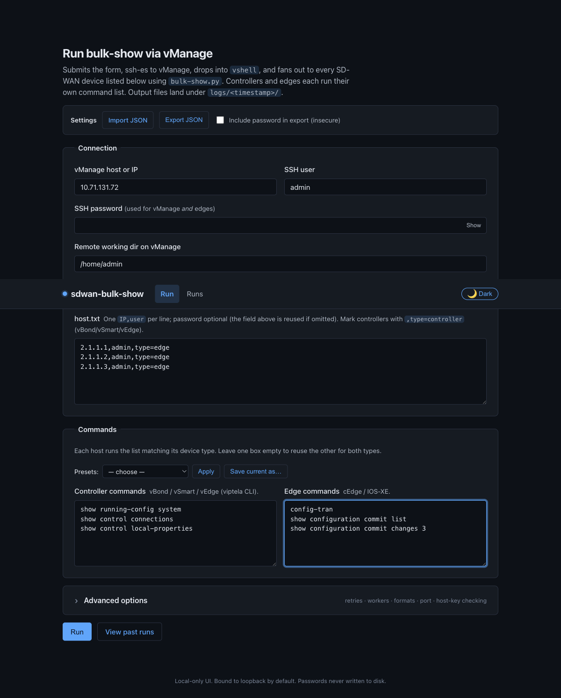

# Web UI walkthrough

The project ships a small **local** FastAPI web UI (see [`webapp/`](../webapp))
that wraps `run_on_vmanage.py` + `bulk-show.py`, so you can drive a run from a
browser instead of the CLI. It binds to loopback only and never writes
passwords to disk.

Start it and open the page:

```bash
python -m webapp            # then browse to http://127.0.0.1:8000/
```

This page walks through one full run and the review screens end to end.

> The screenshots below were captured against a lab vManage
> (`10.71.131.72`) fronting three cEdge routers (`2.1.1.1`–`2.1.1.3`). They
> show **real device output** (including configuration and a hashed secret) for
> illustration; sanitize your own inventory before sharing screenshots.

---

## 1. Fill in the run form

The landing page (`/`) is the run form, grouped into **Connection**,
**Inventory**, and **Commands**.

- **Connection** — vManage host/IP, SSH user, the SSH password (reused for
  vManage *and* the edges), and the remote working dir.
- **Inventory** — `host.txt`, one `IP,user` per line. The password is optional
  per line (the Connection password is reused when omitted). Mark controllers
  with `,type=controller`.
- **Commands** — controllers and edges each run their own list, so you can send
  viptela-CLI commands to vBond/vSmart/vEdge and IOS-XE commands to cEdges in
  the same run. Presets let you apply/save common command sets.



## 2. Advanced options

Expand **Advanced options** for retries per host, max workers, the controller
SSH port, the per-host output formats (`text` / `json` / `csv`), whether to
download the `output_*` files back to `logs/<timestamp>/`, verbose logging, and
strict host-key checking.



## 3. Submit and watch progress

Press **Run**. Progress is shown inline with a phase tracker
(Connect → Upload → Execute → Download → Done), a live log (with the password
masked), and live `status` / `commands` / `hosts` counters.



## 4. Results

When the run finishes, the results panel appears in place. From here you can
open the run detail, jump to the full compare view, reveal the folder in Finder,
open it in Terminal, or tick two output files and press **Diff**.



## 5. Past runs

The **Runs** page (`/runs`) lists every run found under `logs/`, newest first,
with status, host counts, and output/file counts. Filter by timestamp, vManage,
or status, or tick two runs to diff a host across them.



## 6. Run detail

Clicking a timestamp opens the run detail (`/runs/<timestamp>`): summary cards
(hosts, ok/failed, controller/edge command counts, outputs), a per-host results
table, and the list of output files.



## 7. View a device's output

Opening an `output_*.txt` shows the captured session as a continuous,
terminal-like transcript. Note the `show configuration ...` output is fully
captured and clean — the config-mode pager (`--More--` / `(END)`) is drained
automatically and its redraw noise is stripped.



## 8. Compare a host across two runs

**Compare across runs** (`/runs/compare-across`) diffs one device's
`output_*.txt` between two runs: enter the two timestamps, load the common
hosts, and pick one for a side-by-side colorized diff (here the only change is
the command timestamps).



## 9. Light / dark / system theme

The theme toggle in the header cycles **System → Light → Dark** and is
remembered across pages.


